# Yet another Pulsar Tutorial Using Java

On this tutorial we will use the StreamNative's Cloud Console to create a new cluster instance of the preferred cloud provider and we will use a Java Producer and a Java consumer to interact with Pulsar. 

I will assume you already have a StreamNative's cloud console account, if not, please sign up for a free account [https://streamnative.io/free\-cloud/](https://streamnative.io/free-cloud/)

## **1. Sign up and log in**

Once you created the account, connect to [https://console.streamnative.cloud/](https://console.streamnative.cloud/) and proceed to login:

images/1.login.png
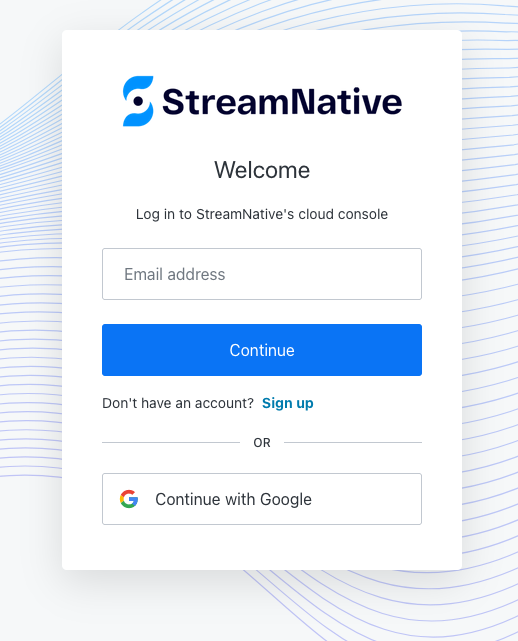

Access to the console using your credentials.

## **2. Create an Instance**

If you don't have a free account, please follow the steps from [Quick start with StreamNative Cloud Manager](https://docs.streamnative.io/cloud/stable/quickstart/quickstart-manager) starting from [Step 2: Create an instance](https://docs.streamnative.io/cloud/stable/quickstart/quickstart-manager#step-2-create-an-instance) and then [Step 3: Create a cluster](https://docs.streamnative.io/cloud/stable/quickstart/quickstart-manager#step-3-create-a-cluster)

After login, the first page you see after the login is the Organization, please click the newly  created Organization and then from the Dashboard,  proceed to create a new Instance.


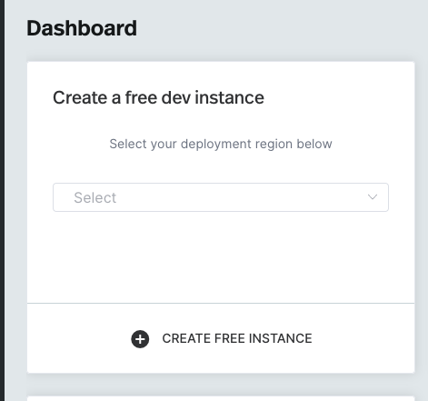

Select the deployment region from the list and click **CREATE FREE INSTANCE**, the process will take between 5\-10 minutes to create the cluster.

When it finish, you will see the new Cluster details:


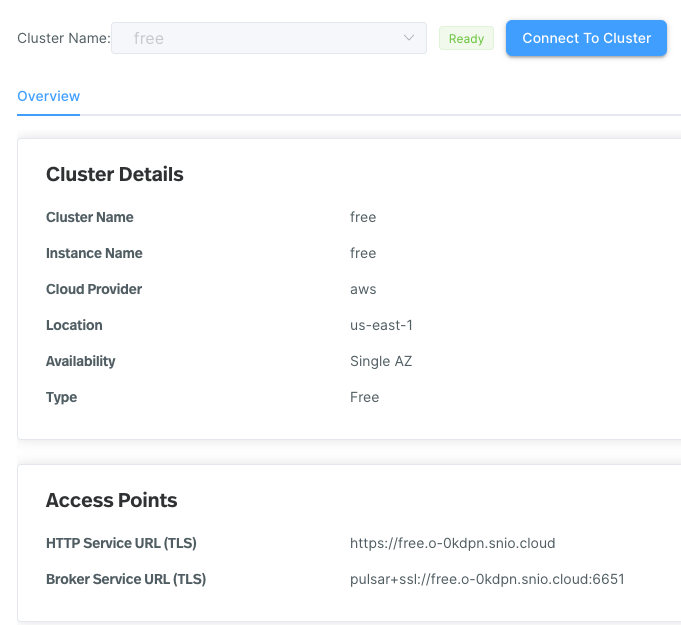

## **3. Get the Key File**

Create a new directory to store the files, using your terminal execute:

```bash
mkdir ~/sn
```

and then

```bash
cd ~/sn
```

From the left menu, click the **Service Accounts** link to download the Key File, save it to **~/sn** and from the **ADMIN** section the click the **Pulsar Cluster** link.

In this Cluster overview page, click **Connect to the Cluster** button


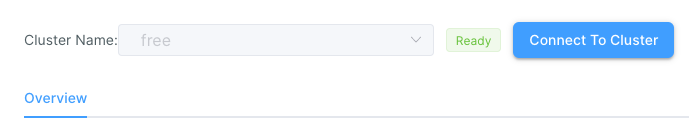

and then follow the steps to configure the pulsar client locally. If you are using mac, set 

```bash
file://YOUR-KEY-FILE-PATH

to 

file:///the/path/to/the/key/file/json
```

make sure you are using **file:///**

```bash
1. mkdir -p ~/.sncloud/

2. export PULSAR_CLIENT_CONF=~/.sncloud/client.conf

3. echo '
webServiceUrl=https://free.o-0kdpn.snio.cloud
brokerServiceUrl=pulsar+ssl://free.o-0kdpn.snio.cloud:6651
authPlugin=org.apache.pulsar.client.impl.auth.oauth2.AuthenticationOAuth2
authParams={"privateKey":"file://YOUR-KEY-FILE-PATH", "issuerUrl":"https://auth.streamnative.cloud/", "audience":"urn:sn:pulsar:o-0kdpn:free"}
tlsAllowInsecureConnection=false
tlsEnableHostnameVerification=true
' > $PULSAR_CLIENT_CONF

```

## **4. Download Pulsar binaries**

Make sure you have Java JDK installed and then:

```bash
1. wget https://archive.apache.org/dist/pulsar/pulsar-2.10.1/apache-pulsar-2.10.1-bin.tar.gz

2. tar xvfz apache-pulsar-2.10.1-bin.tar.gz

3. cd apache-pulsar-2.10.1
```

## **5. Create a new Tenant,  Namespace and Topic**

On the left navigation pane, under **Tenant/Namespace**, select the current default tenant/namespace, and then click **New Tenant**

Configure the following properties and click **Confirm**

- **Tenant**
- **Allowed Clusters**
- **Admin Role**

Click the new **Tenant** created and then click the **New Namespace** button.

I created **tenant1** and **namespace1**:


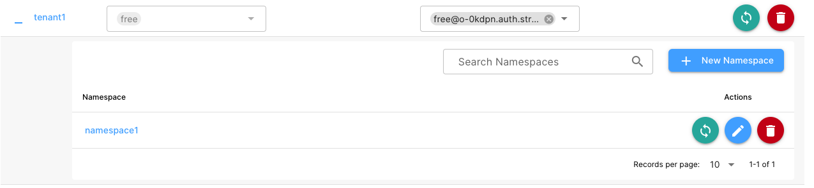

On the left navigation pane, under **Resources**, click **Topics**, and then **New Topic**.

Configure the following properties and click **Confirm**

- **Domain**
- **Topic Name**
- **Partitions**

My new topic is called my\-topic


## **6. Test pulsar terminal client**

```bash
./bin/pulsar-admin tenants list

./bin/pulsar-admin namespaces list tenant

./bin/pulsar-admin topics list tenant1/namespace1
```

## **7. Create a Secret Key**

```bash
./bin/pulsar tokens create-secret-key --output /Users/scaica/sn/my-secret.key --base64
```

```bash
./bin/pulsar tokens create --secret-key /Users/scaica/sn/my-secret.key --subject free@o-0kdpn.auth.streamnative.cloud
```

The output for the command will be the token string.

```bash
eyJhbGciOiJIUzI1NiJ9.eyJzdWIiOiJmcmVlQG8tM.....RbOYkDvjrVLPOXPPy7J079sGcSvrrxs85X-or-RAQ
```

```bash
./bin/pulsar-admin namespaces grant-permission tenant1/namespace1 \
            --role free@o-0kdpn.auth.streamnative.cloud \
            --actions produce,consume
```

## **8. Create a Subscription**

```bash
./bin/pulsar-admin topics create-subscription --subscription my-subscription persistent://tenant1/namespace1/my-topic
```

at this point we are able to consume from the topic using one of the commands below:

```bash
./bin/pulsar-client consume persistent://tenant1/namespace1/my-topic -s 'my-subscription' -p Earliest -n 0

./bin/pulsar-client consume tenant1/namespace1/my-topic -s 'my-subscription' -p Earliest -n 0
```

but as we didn't write any message yet, and the topic is empty, the consumer doesn't show anything.

## **9. Create  the Java Producer Code**

I will use IntelliJ IDEA to create the code, you can use the one you like or feel more comfortable.

Download the Community Edition from [https://www.jetbrains.com/idea/download](https://www.jetbrains.com/idea/download) and install.

Then from **File \> New \> Project** set the properties and click Create:

- **Name**
- **Location**
- **Language**
- **JDK**


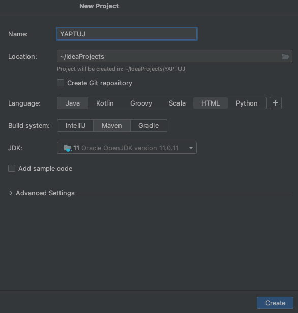

### **9.1 Set the pom.xml**

Edit your pom.xml file to add pulsar dependencies:

original:

```xml
<?xml version="1.0" encoding="UTF-8"?>
<project xmlns="http://maven.apache.org/POM/4.0.0"
         xmlns:xsi="http://www.w3.org/2001/XMLSchema-instance"
         xsi:schemaLocation="http://maven.apache.org/POM/4.0.0 http://maven.apache.org/xsd/maven-4.0.0.xsd">
    <modelVersion>4.0.0</modelVersion>

    <groupId>org.example</groupId>
    <artifactId>YAPTUJ</artifactId>
    <version>1.0-SNAPSHOT</version>

    <properties>
        <maven.compiler.source>11</maven.compiler.source>
        <maven.compiler.target>11</maven.compiler.target>
        <project.build.sourceEncoding>UTF-8</project.build.sourceEncoding>
    </properties>

</project>
```

we will add pulsar version into the properties:

```xml
<pulsar.version>2.10.1</pulsar.version>
```

and the dependencies:

```xml
<dependencies>
        <dependency>
            <groupId>org.apache.pulsar</groupId>
            <artifactId>pulsar-client</artifactId>
            <version>${pulsar.version}</version>
        </dependency>
    </dependencies>
```

finally our pom.xml will look like:

```xml
<?xml version="1.0" encoding="UTF-8"?>
<project xmlns="http://maven.apache.org/POM/4.0.0"
         xmlns:xsi="http://www.w3.org/2001/XMLSchema-instance"
         xsi:schemaLocation="http://maven.apache.org/POM/4.0.0 http://maven.apache.org/xsd/maven-4.0.0.xsd">
    <modelVersion>4.0.0</modelVersion>

    <groupId>org.example</groupId>
    <artifactId>PulsarProducer1</artifactId>
    <version>1.0-SNAPSHOT</version>

    <properties>
        <maven.compiler.source>11</maven.compiler.source>
        <maven.compiler.target>11</maven.compiler.target>
        <project.build.sourceEncoding>UTF-8</project.build.sourceEncoding>
        <pulsar.version>2.10.1</pulsar.version>
    </properties>
    <dependencies>
        <dependency>
            <groupId>org.apache.pulsar</groupId>
            <artifactId>pulsar-client</artifactId>
            <version>${pulsar.version}</version>
        </dependency>
    </dependencies>

</project>
```

### **9.2 Create the Producer Class**

From the Project section we will expand **src \> main \> java** and with the secondary button of the mouse we will select **New** and click **Package** to create a new Java package in our project called **[org.sn.pulsar](http://org.sn.pulsar)** and press Enter:


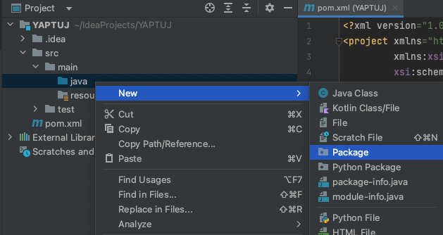

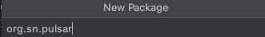

Now, we will proceed to create the Java Producer class. As we did to create the package, this time with the mouse secondary button, we will select **New \> Java Class** and we will select **Class**  and named it **PulsarProducer.**

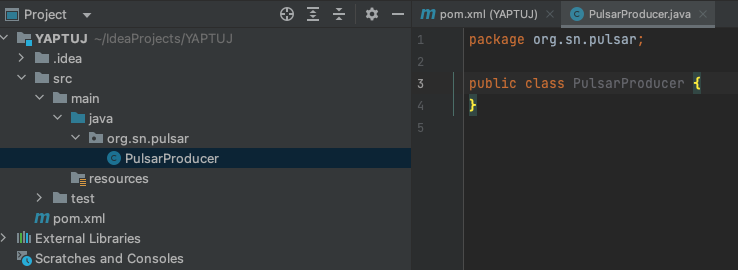

Our class is empty, and we need to create the code, first we need to write the main method with 3 variables:

```java
public static void main(String[] args){
        final String HOME = "/Users/scaica/sn";
        final String TOPIC = "persistent://tenant1/namespace1/my-topic";
        final String PULSARURL = "pulsar+ssl://free.o-0kdpn.snio.cloud:6651";
}
```

the first variable will set our home directory of the auth files, the second is the Pulsar topic, and the third our Pulsar URL.

Now we need to add 3 more variables to set the authentication. As we will use [OAuth2](https://pulsar.apache.org/docs/next/security-oauth2) we need to set:

- **issuerUrl:** 
- **credentialsUrl:** 
- **audience:**

```java
URL issuerUrl = new URL("https://auth.streamnative.cloud/");
URL credentialsUrl = new URL("file://"+HOME+"/o-0kdpn-free.json");
String audience = "urn:sn:pulsar:o-0kdpn:free";
```

The 3 properties value are present in the client.conf file, and we will add **throws MalformedURLException** to the main method :

```bash
authParams={"privateKey":"file://YOUR-KEY-FILE-PATH", "issuerUrl":"https://auth.streamnative.cloud/", "audience":"urn:sn:pulsar:o-0kdpn:free"}
```

Create the PulsarClient code:

```java
PulsarClient client = PulsarClient.builder()
                .serviceUrl(PULSAR_URL)
                .authentication(AuthenticationFactoryOAuth2.clientCredentials(issuerUrl, credentialsUrl, audience))
                .build();
```

this will force to add **PulsarClientException** to the main method.

It is time to add the producer:

```java
Producer<byte[]> producer = client.newProducer().topic(TOPIC).create();
```

and then we will put the section to write messages to the topic:

```java
for(int idx = 0; idx < 100; idx++) {
    String message = "Added message #"+idx;
    producer.send(message.getBytes());
}
```

Finally will will add:

```java
System.exit(0);
```

Our final code will look like:

```java
package org.sn.pulsar;

import org.apache.pulsar.client.api.Producer;
import org.apache.pulsar.client.api.PulsarClient;
import org.apache.pulsar.client.api.PulsarClientException;
import org.apache.pulsar.client.impl.auth.oauth2.AuthenticationFactoryOAuth2;

import java.net.MalformedURLException;
import java.net.URL;

public class PulsarProducer {
    public static void main(String[] args) throws MalformedURLException, PulsarClientException {
        final String HOME = "/Users/scaica/sn";
        final String TOPIC = "persistent://tenant1/namespace1/my-topic";
        final String PULSAR_URL = "pulsar+ssl://free.o-0kdpn.snio.cloud:6651";

        URL issuerUrl = new URL("https://auth.streamnative.cloud/");
        URL credentialsUrl = new URL("file://"+HOME+"/o-0kdpn-free.json");
        String audience = "urn:sn:pulsar:o-0kdpn:free";

        PulsarClient client = PulsarClient.builder()
                .serviceUrl(PULSAR_URL)
                .authentication(AuthenticationFactoryOAuth2.clientCredentials(issuerUrl, credentialsUrl, audience))
                .build();

        Producer<byte[]> producer = client.newProducer().topic(TOPIC).create();

        for(int idx = 0; idx < 100; idx++) {
            String message = "Added message #"+idx;
            producer.send(message.getBytes());
        }

        System.exit(0);
    }
}
```

Let's test it. First, to check if the messages are written, we will start a consumer for the topic:

```bash
./bin/pulsar-client consume tenant1/namespace1/my-topic -s 'my-subscription' -p Earliest -n 0
```

To compile and execute our Java Producer, we will click over the class code with the mouse secondary button, and click **Run 'PulsarProducer.main\(\)'**


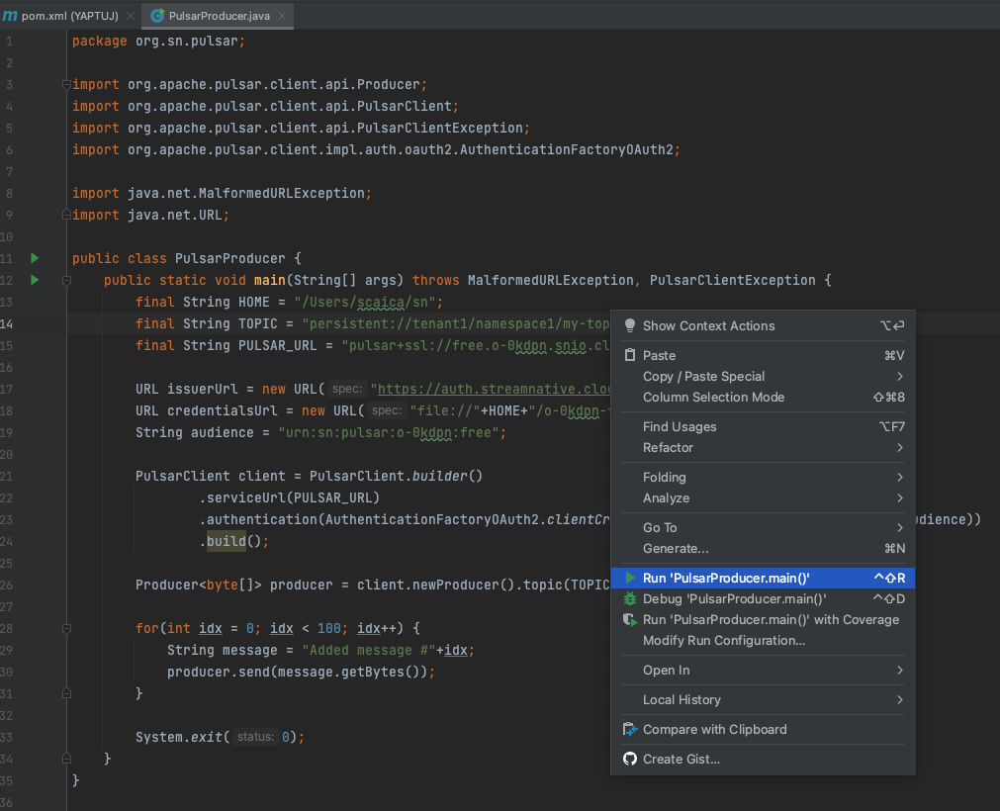

After a while, if everything is ok we will see from the Pulsar consumer the messages written:

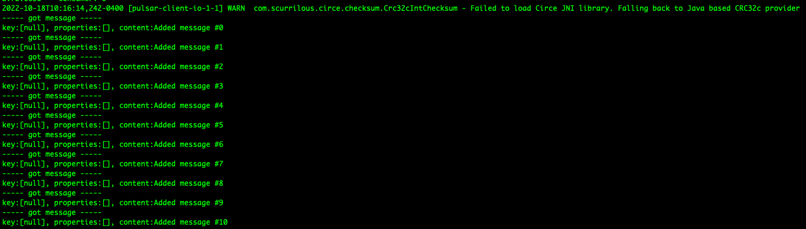
